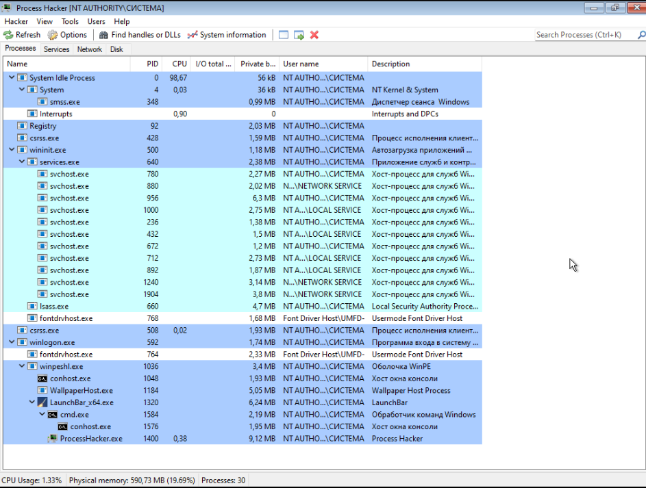

# minimal-winpe

Minimal winpe is collection of scripts that create bootable Windows distro
similar to Hiren's BootCD, Sergei Strelec WinPE.

While knowing about and somewhat being influenced by projects like
Win10XPE, wimbuilder2 and pebakery, I found them hard to comprehend as a
Linux user and separate needed things from unneeded.
So now this project exists.



# Legal disclaimer

```
Windows PE is not a general-purpose operating system.
It may not be used for any purpose other than deployment and recovery.
It should not be used as a thin client or an embedded operating system.
There are other Microsoft products, such as Windows Embedded CE, which may be used for these purposes.

To prevent its use as a production operating system,
Windows PE automatically stops running the shell and restarts after 72 hours of continuous use.
This period is not configurable.
```

https://learn.microsoft.com/en-us/windows-hardware/manufacture/desktop/winpe-intro?view=windows-11#limitations

Using this project to violate Microsoft copyright and/or to use Windows for free
is prohibited (by Microsoft) and punishable with Microsoft sponsored death squads (of
lawyers), so beware.
I do not own any responsibility for **your** actions with this toolchain.

# Building custom Win PE

Not everything is working for now (FileOpen, FileSave dialogs, for example, don't),
but many things doo. This aspect will continue to improve.

## Requirements

In order to build WinPE iso, you will need:

1. qemu
1. wget
1. hivex (libguestfs)
1. wimlib (mkwinpeimg, wimmount)

## Building

Clone this repo and run

```sh
sudo ./src/mkwinpe.sh -p -s *path to windows installation iso*
```

After that create qemu image

For example:

```sh
qemu-img create -f raw winpe.img 16G
```

and install `winpe.iso` to it:

```sh
qemu-system-x86_64 \
        -cpu host \
        -enable-kvm \
        -m 3000 \
        -smp 2 \
        -cdrom winpe.iso \
        -drive file=winpe.img \
        -boot order=d
```

After that, `winpe.img` will contain all needed files to boot from it, so
it can be burned on your USB drive (I didn't test in yet, but suppose it will do okay).

You can also install additional recommended software that eases customization of
your Windows distro:


For the first boot just click OK 


After launching `cmd` run 

```bat
cd X:\
full_first_boot.cmd
```

This will install all recommended software via using
[Chocolatey](https://community.chocolatey.org/packages) and
[Scoop](https://scoop.sh) (99% is Scoop).


